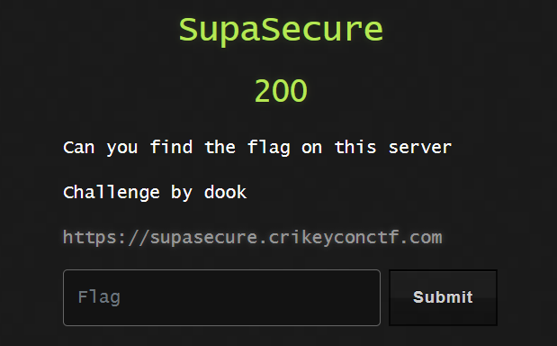

<p align="center">
  
</p>
<h1 align="center" style="margin-top: 0px;">SupaSecure</h1>

<p>Alright, let's get a quick look at this website, https://supasecure.crikeyconctf.com/</p>


We get this very modern looking web-page. I'm eager to get logged in so let's check out `/login`.


Hmm, nothing to `GET` here, then let's try make a `POST` request to this page instead. Burpsuite makes this kind of thing really easy to do.
Using burpsuite we can intercept the request made when we try to go to the webpage `https://supasecure.crikeyconctf.com/login`. Here's that intercepted request.


If burpsuite is completely new to you then you should definitely learn how to use it. There's plenty of tutorials on how to use it and it will be one of your most valuable tools when doing web challenges. Anyway, once we've got that `GET` request intercepted we'll send it to burpsuites `repeater`. This'll let us `repeat` and edit this exact request as many times as we want.

Like I said earlier, we want to make a `POST` request instead of a `GET` request. Once we're in the repeater this becomes very easy to do, just right-click on the request you imported and press `change request method` and boom, burpsuite automagically changes your request method.


Awesome, now we can just send this payload and observe the response.


Oooo, that's interesting. Looks like the page expected some data coming with the `POST` request. Now, it's important to notice here that the page was expecting `JSON` data. To send `JSON` data in your requests you need to specify that that's the kind of data that you're sending, so the server that's receiving it knows how to interpret it. To do that we use a Header called `Content-Type:`, and you can see in our earlier requests that that header is set to `application/x-www-form-urlencoded`. This is simply telling the server that we're sending url encoded information.

Now, to send `JSON` data, all we need to do is change that Header to `application/json`. *The author even hints at this a little*


If you're interested you can look at all the different values for the `Content-Type:` header <a href="https://developer.mozilla.org/en-US/docs/Web/HTTP/Basics_of_HTTP/MIME_types">HERE</a>. But just changing that doesn't fix our problem, the server said it was expecting something like `{"user":"user","pass":"user"}` so let's give it that. Editing our request to include that `JSON` looks like this,

```
POST /login HTTP/2
Host: supasecure.crikeyconctf.com
Cache-Control: max-age=0
Sec-Ch-Ua: " Not A;Brand";v="99", "Chromium";v="104"
Sec-Ch-Ua-Mobile: ?0
Sec-Ch-Ua-Platform: "Windows"
Upgrade-Insecure-Requests: 1
User-Agent: Mozilla/5.0 (Windows NT 10.0; Win64; x64) AppleWebKit/537.36 (KHTML, like Gecko) Chrome/104.0.5112.102 Safari/537.36
Accept: text/html,application/xhtml+xml,application/xml;q=0.9,image/avif,image/webp,image/apng,*/*;q=0.8,application/signed-exchange;v=b3;q=0.9
Sec-Fetch-Site: none
Sec-Fetch-Mode: navigate
Sec-Fetch-User: ?1
Sec-Fetch-Dest: document
Accept-Encoding: gzip, deflate
Accept-Language: en-US,en;q=0.9
Content-Type: application/json
Content-Length: 42

{
"user":"APender",
"pass":"test"
}
```


