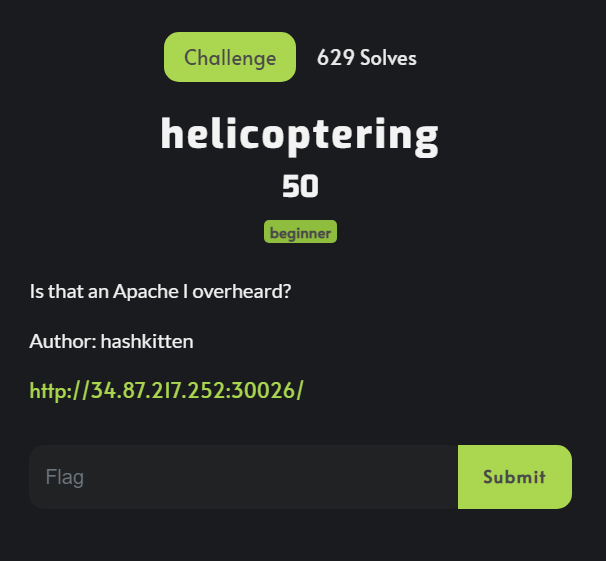

  

<h1 align="center" style="margin-top: 0px;">Helicoptering</h1>

Alright, so going to the link they give us we get this webpage.

Okay, so first thing I notice is all these helicopter references. Apache is a common web server software but it's also a type of attack helicopter. Sooooo, which one could it be? Here, take your pick:

|  |  |

