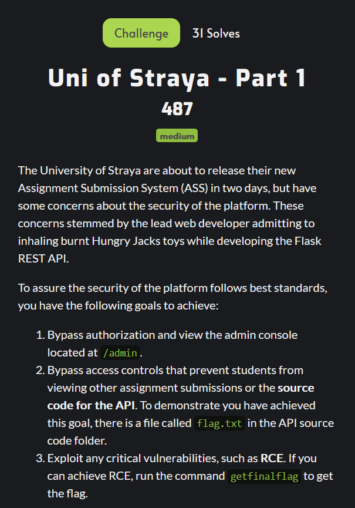

<p align="center">
  
</p>
<h1 align="center" style="margin-top: 0px;">Uni of Straya - Part 1</h1>

Daaamn, that description is long, looks pretty scary. Luckily for this first part we just need to focus on that first point.

**Bypass authorization and view the admin console located at ``/admin``**

Alright, so here's what the main page looks like.


Registering and logging in we get a similar looking page with different prompts. All of which don't give any useful information. 


Trying to go to `/admin` we get logged out and redirected to the main screen.

I wanted to see what kind of authentication was being used and looking in our web storage we've got a JWT token stored in local storage, there's also a field for userId but changing this does nothing.

At this point I wanted to look into what javascript was being run on each page, since I noticed a `main.js` and `dashboard.js` in the source of the two pages we've been to so far. Every `.js` and `.html` file I came across I saved locally and opened up in Visual Studio Code, that way I can easily navigate and see what's going on.

Once I had all that set out I wanted to take a deeper look into what happens when we request `/admin` since I noticed when we try load the page sometimes the webpage loads for a second and then we get redirected.

Loading up burpsuite and requesting the page serves us html, if we render that it looks like this.


That page refers to an `admin.js` file, so I saved the source for that file too.

Now that I had the important `.html` and `.js` files I spent a long time analysing them. A quick realisation was that there were heaps of calls to an API. I tested this API a lot using https://reqbin.com/, definitely my favourite tool for this kind of stuff. I quickly realised that our authorisation was very limited, the JWT token of a standard user only allows us to access a few functionalities. On the topic of our JWT token, here's what it looks like decoded using https://jwt.io/ (another great tool).


Notice anything interesting? For me, that directory looked super interesting. As soon as I saw that I thought I might be able to get SSRF (Server-Side Request Forgery). SSRF is where you get the server itself to make a request to whereever you want. My idea was that maybe the server has to follow that directory when it goes to sign our JWT for authentication, if we can change that then maybe we can get it to send a request to somewhere other than `/api/auth/pub-key`.

To test this I crafted a new JWT, keeping everything else the same but changing the header to this:

```json
{
  "alg": "RS256",
  "iss": "https://requestbin.io/z39ug0z3",
  "typ": "JWT"
}
```
https://requestbin.io is a great website for grabbing http callbacks, you can just generate and link and it will log any request made to it.

Sending a request to an API endpoint we don't have access to gives us this response:

```json
{
    "result": "M8 you broke something: ISS needs to match ^/api/auth/pub-key!",
    "status": "error"
}
```

Hm, okay, that regex seems pretty easy to bypass. We could use something like ``/api/auth/pub-key/../../../../`` to get back to the base url. The only problem now is that we can't pass in a straight url since it will try to use it as a directory, it's not just slapped into a request, in fact I made this mistake in my last payload as well, that would've never worked because the original payload had a relative path.

As soon as I ran into this issue I went back to the source code I had, almost immediately I noticed this in `admin.js`!!!

```js
setInterval(() => {
        authAjax({
            url: "/api/auth/isstaff",
            type: "GET",
            success: (data) => {
                if (data.status === "error") {
                    window.location = "/api/auth/logout?redirect=/logout";
                }
            },
            error: errorCallback
        });
    }, 60000);
```

Do you see that? There's an api endpoint that redirects the user to a url. That's how it was kicking us out of the page, that also explains why sometimes it wouldn't kick us out immediately, it had to wait for the api.

Anyway, this is huge! If we can make the server go to this endpoint we can control where it gets redirected, aka **SSRF**!!!. Let's make the payload!

Alright so we know we can get to the base url using directory traversal ``/api/auth/pub-key/../../../../``, now we just need to go to the logout endpoint. That looks like this,

``/api/auth/pub-key/../../../../api/auth/logout?redirect=EVIL``

Let's put our requestbin url in our EVIL parameter and throw it in a JWT. Our JWT header now looks like this.

```json
{
  "alg": "RS256",
  "iss": "/api/auth/pub-key/../../../../api/auth/logout?redirect=https://requestbin.io/z39ug0z3",
  "typ": "JWT"
}
```

Sending that through...

```json
{
    "result": "M8 you broke something: ('Could not deserialize key data. The data may be in an incorrect format, it may be encrypted with an unsupported algorithm, or it may be an unsupported key type (e.g. EC curves with explicit parameters).', [_OpenSSLErrorWithText(code=75497580, lib=9, reason=108, reason_text=b'error:0480006C:PEM routines::no start line')])",
    "status": "error"
}
```

NO WAY


So we have SSRF, but it's kinda limited right? We don't get any real feedback on what the serv


