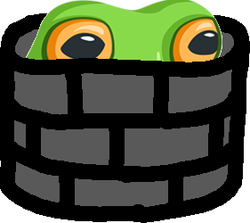

<p align="center">
  
</p>
<h1 align="center" style="margin-top: 0px;">Whack a Frog!</h1>


<p>Alright, let's jump into it! We get linked to this web page where we can click and drag to draw with frogs.</p>


<p>That big square over on the left is our canvas. So, usually the first thing you go to when you start a web challenge is go into the inspect window, pretty quickly we notice there's HEAPS of GET requests being made. These requests look like this:</p>


So, the mouse x, y positions and 'event' is being sent to the server the whole time. Looking closer at other requests, there's three events that can get sent, `mousemove`, `mouseup` and `mousedown`. 

<h2 align="center">The .pcap file</h2>

Okay cool, so you may have noticed that in the challenge we got given a `.pcap` file. If you're not familiar with `.pcap` files, the `.pcap` extension refers to a packet capture file. So, these files contain captured packets. A common place to analyse these files (or even make them), is Wireshark. So lets open `whacking-the-froggers.pcap` in Wireshark.


As soon as we get it open we see something familiar! A HTTP request with the payload we saw earlier from our webpage. This is definitely what we're interested in, so we can just ignore all the TCP packets. Let's apply a filter in Wireshark to filter them out.


We don't really need all those HTTP responses either (the 200 OK's), so lets filter those out also. Here's what we get.


Oooo, okay, are you thinking what I'm thinking? Well, we've been given packets sent from someone to the server, containing every mouse movement they made while on the frog whacking app, so what else is there to do other than simulate what they drew on that canvas?!

Alright, so we're going to need to extract the x and y coordinates of the mouse and its current `event` from each packet. The way I went about this was to use python and  `pyshark` to read the `.pcap` file. That process looks like this:

```py
import pyshark

pcap = pyshark.FileCapture("C:\\Users\\ssamu\\Downloads\\moves.pcap")

class movement:
    def __init__(self, x, y, event):
        self.x = x;
        self.y = y;
        self.event = event;

movements = []
isDragging = False

for pkt in pcap:
    request = pkt[pkt.highest_layer].request_uri
    x = request[request.find('x') + 2 : request.find('&')]
    y = request[request.find('y') + 2 : request.find('&', request.find('&') + 1)]
    event = request[request.find('event') + len('event='):]
    
    movements.append(movement(x,y,event))
```

<h2 align="center">Getting their mouse movements onto my screen</h2>

So now we have a list of movements, each with their x,y and `event`. How do we translate that onto the webpage? My idea was to use a javascript method, `document.elementFromPoint(x,y)`. This method takes coordinates and maps them to the screen based on your current viewport, then selects the element at that coordinate. This is perfect, since a brief look at `main.js` of the webpage shows that the x and y coordinates are pulled from javascripts coordinate system.
```js
document.body.addEventListener("mousemove", async event => {
  await fetch(`/anticheat?x=${event.clientX}&y=${event.clientY}&event=mousemove`)
});
document.body.addEventListener("mouseup", async event => {
  await fetch(`/anticheat?x=${event.clientX}&y=${event.clientY}&event=mouseup`)
});
document.body.addEventListener("mousedown", async event => {
  await fetch(`/anticheat?x=${event.clientX}&y=${event.clientY}&event=mousedown`)
});
```
So, in the same python script from earlier, we print out a `document.elementFromPoint(x,y)` for every move in movements (using that moves x and y coordinates). We also make sure that we only print it for when they were dragging their mouse, since we know we can only draw on the canvas when our mouse is down (and we're given `mousedown`, `mouseup` and `mousemove`).
```py
for move in movements:
    if (move.event == 'mousedown'):
        isDragging = True
    elif (move.event == 'mouseup'):
        isDragging = False
    
    if (isDragging):
        print(f"document.elementFromPoint({move.x}, {move.y}),")
```
Notice when I printed that `document.elementFromPoint()` string I put a `,` at the end. This is because my plan is to paste the list of commands printed by this script straight into the console as an array. This means we'll have an array of every element that the person dragged over. I'll show you what this looks like.

### Output from our python script


### Array made in our developer console


Each frog on our canvas is represented by an image. I figured the best way to see which were dragged over would be to set their src to `null`, this will make them appear as missing images (making them easy to see). So, after making that array we just run the following code that loops through it and changes any img's source to `null`.
```js
x.forEach((element) => { if (element.src) {element.src = null;} })
```
With our screen zoomed out, this results in the following


But that isn't legible is it? It looks like it was cut off at the top! This is where it's important to remember that those coordinates are based off of the current viewport!!!

When I initialised that array, my window was zoomed out all the way. So we have to try initialising that array again a bit lower down and zoomed in so that it aligns with the canvas. Doing so, we get this.


And there's our flag! `corCTF{LILYXOX}`

This was a great challenge because there were so many was of solving it. I saw others who instead of mapping it in the webpage just put the coordinates into desmos. This gave them an upside down image though because the coordinate system is different, but flipping their result upside down gives them the flag. Anyway, hope you enjoyed reading about this very enjoyable challenge.

I'll upload the python script I used in this repository if you want to take a look.
